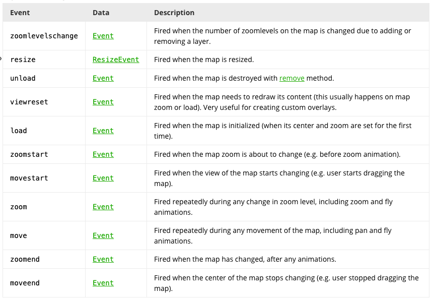

本文档主要记录的是基于 [Vue2Leaflet](https://korigan.github.io/Vue2Leaflet/#/components/l-map/?id=methods)第三方框架的一些问题解决办法

## 1 一些常见的map问题
以下均为自己项目中所遇见的问题，会包含实际项目代码及解决办法
### 1.1 按照缩放比例加载不同的divIcon
我要实现的效果，在地图缩放过程中，当缩放比例大于6以后只显示缩率的div，而小于等于6时则显示完整的div

大概的思路如下：
> 使用icon_div，然后其中通过两个div，根据变量控制其是否显示(v-show)，并通过监听zoom 的方式来判断是否要显示精简或者是详情div  

eg：
1. 外层的`l-map` 进行监听zoom
```html
<l-map ref="basemap" :zoom="zoom" :center="center" 
@click="createMarker"
@update:zoom="zoomUp">
```

2. 在l-map中嵌套的l-marker中的l-icon中的两个table  
主要是通过变量`zoom_mark_minifier`根据缩放的等级，通过`v-show`来控制显示的自定义div
eg:
```html
<l-marker
      v-for="(station,index) in station_tide_list"
      :key="station.id"
      :lat-lng="station.point|formatPoint"
      @mouseover="upZIndex(index,station)"
      @mouseout="downZindex(index,station)"
      @click="changeStationIndex(index,station)"
      :options="icon_div_station_option"
    >
      <!-- TODO:[*] 19-04-23 注意此处将click从父级的l-marker中放在了子级中的l-icon中了——扔不行 -->
      <l-icon :options="icon_div_station_option">
        <div id="station_form" v-show="index!=select_station_index" 
        class="fade_enter" :class="zoom_mark_minifier ? 'minifier ' : ''">
          <table v-show="!zoom_mark_minifier" class="table table-bordered"  border="1">
           ...
          </table>
          <!-- 缩小至6级以内只显示风暴增水，将宽度设置为50px（固定值） -->
          <table v-show="zoom_mark_minifier" class="table table-bordered " border="1">
            ...
          </table>
        </div>
```
缩放时触发的方法
```js
zoomUp(val): void {
    if (val > this.zoom_index) {
      if (val > 6) {
        this.zoom_mark_minifier = false;
      }
    }
    if (val < this.zoom_index) {
      if (val <= 6) {
        // 缩放到6级后只加载测站的风暴增水不再显示名字
        this.zoom_mark_minifier = true;
      }
    }
    this.zoom_index = val;
  }
```

小结：
1. 使用到了vue2leaflet中的 `update` 监听地图某些事件被触发时执行
[参考](https://korigan.github.io/Vue2Leaflet/#/components/l-map/?id=methods)

update：zoom - 当地图缩放发生变化时update:zoom发出- 与Number表示当前值的值一起发出zoom

>update：center - 当地图中心发生变化时update:center发出- 与L.LatLng表示当前L.latLng的值实例一起发出 center  

>update：bounds - 当地图边界发生变化时update:bounds发出- 与L.latLngBounds表示当前L.latLngBounds的值实例一起发出  bound  

>update：zoom，update：center，update：bounds是基于leaflet moveend事件和支持sync修饰符的所有去抖动事件

其中leaflet中关于map的一些事件:
[参考官方文档](https://leafletjs.com/reference-1.5.0.html)  
